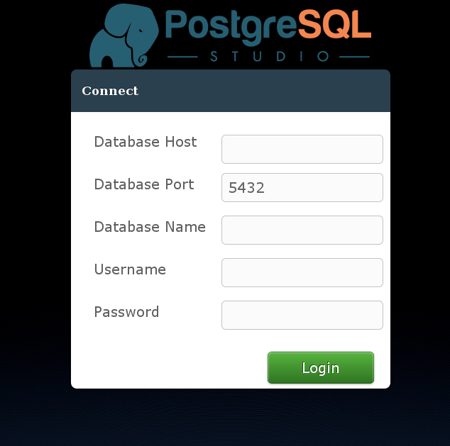

# docker-pgstudio  [](https://imagelayers.io/?images=lukasmartinelli/pgstudio:latest 'Get your own badge on imagelayers.io')

> :warning: This repository is no longer maintained by Lukas Martinelli.

PostgreSQL Studio wrapped in a neat little Docker container.
The image is available on [Docker Hub](https://registry.hub.docker.com/u/lukasmartinelli/pgstudio/).

Run the image

```
docker run --rm -p 8080:8080 -t lukasmartinelli/pgstudio
```

Connect to your database via `http://localhost:8080` and enter
your database credentials.


